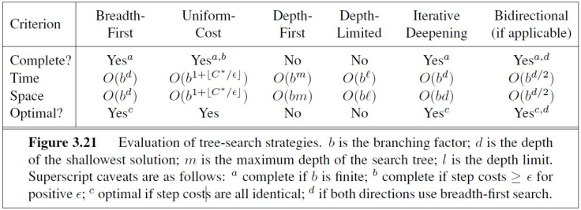

# AI Summary

> @ Karl 2020/1/5

[toc]

## 1 搜索 Search

### 1.1 形式化 Formalization

1. 状态空间 state space
2. 动作 actions
3. 初始状态 initial state
4. 目标状态 goal
5. 启发函数 heuristics

对于已经形式化的问题，它的一个解 solution 是一个动作序列，该动作序列可以将初始状态转换为目标状态。

---

### 1.2 搜索算法的性质 Properties of Search

#### 1.2.1 完备性 Completeness

若在起始点和目标点间有路径解存在，那么一定可以得到解；

若得不到解，那么一定说明没有解存在。

#### 1.2.2 最优性 Optimality

搜索得到的路径在某个评价指标上是最优的，评价指标一般为路径的长度、代价大小。

---

### 1.3 无信息搜索 Uninformed Search

为方便讨论，定义：

$\textbf{b}:$  所有节点的后继节点数量最大值。

$\textbf{d}: $  最短路径的长度。

$\textbf{m}:$ 最长路径的长度。

#### 1.3.1 宽度优先搜索 Breadth-First

> 维护一个队列，每次取队首节点，将其所有未访问后继节点从队尾加入队列，直到到达目标状态。

* 所有较短路径一定在较长路径之前被扩展到。
* 空间要求太大。

#### 1.3.2 深度优先搜索 Depth-First

> 非递归：维护一个队列，每次取队首节点，将其所有未访问后继节点从队首加入队列，直到到达目标状态。

* 若 m 远大于 d，效果会很差。
* 若有很多解路径，效果会优于BFS。
* 只需要线性空间。

#### 1.3.3 一致代价搜索 Uniform-Cost

> 维护一个**有序队列**，每次取队首节点，将其所有未访问后继节点按代价顺序插入队列，直到到达目标状态。

* 扩展的路径一定是代价最小的路径。
* 所有代价较小路径一定在代价较大路径之前被扩展到。

#### 1.3.4 深度受限搜索 Depth-Limited

> 深度优先的DFS，路径未超过给定限制时与DFS操作一致，超过限制时返回。

* 能解决BFS空间占用太高的问题。
* 能解决DFS搜索无限状态空间时路径太长或无穷的问题。
* 只能找到在限制长度以内的解。

#### 1.3.5 迭代加深搜索 Iterative- Deepening

> 在深度受限的基础上，当在当前限制下没有找到解，则增大限制重复进行，直到找到解为止。

#### 1.3.6 对比分析



---

### 1.4 启发式搜索 Heuristic Search

相比无信息搜索，启发式搜索可以利用问题中隐含的信息，“启发”搜索算法。

定义启发函数$\mathrm{h}(n)$，代表从节点 n 到达目标状态的代价。

#### 1.4.1 贪心最优优先搜索 Greedy Best-First Search

> 维护一个队列，每次取队首节点，对于其后继节点，按照h(n)的大小顺序插入队列，直到达到目标节点。

* 该算法只考虑从节点 n 到目的节点的代价，忽视了从初始节点到达节点 n 的代价，不具有最优性。
* 该算法不具有完备性。

#### 1.4.2 A* 搜索 A-star Search

> 定义一个评价函数 $\mathrm{f}(n) = \mathrm{g}(n) + \mathrm{h}(n)$，其中g(n)是从当前路径到达节点 n 的代价，h(n)不变。

* 该算法是完备且最优的。

#### 1.4.3 迭代加深A* 搜索 IDA*

> 类似无信息搜索中的迭代加深策略。

---

### 1.5 博弈树搜索 Game Tree Search

一颗博弈树有以下性质：

* 根节点是初始状态。
* 每条边是可能的一个动作。
* 每一层代表对弈中的一个玩家。

#### 1.5.1 极大极小算法 MiniMax

> 假设对弈的对手永远会进行最佳的操作，因此，按照以下策略进行游戏：
>
> 1. Max：你的回合，最大化你的收益，以降低对手的收益。
> 2. Mini：对手回合，最小化你的收益，以最大化对手的收益。

可以通过DFS实现。

#### 1.5.2 Alpha-Beta 剪枝 Alpha-Beta Pruning

> 通过剪枝，去除不可能的情况减小计算复杂度。

异形相比，跨行可比。有空就传，有数就比。下往上传，上往下比。

小点删大，大点删小。只往下删，删完就跑。

---

### 1.6 约束满足问题 Constraint Satisfaction Problem

CSP 问题包括：

1. 特征/变量集合：$V_{1}, \dots, V_{n}$
2. 每个特征/变量的可能取值集合/值域：$\operatorname{Dom}\left[V_{i}\right]$
3. 一组约束条件：$C_{1}, \dots, C_{m}$

将CSP描述为一个搜索问题：

1. 初始状态：没有任何目标变量被赋值。
2. 后继函数：为某一个为赋值变量赋值，赋的值不应该违反约束。
3. 目标状态：所有变量都被赋值。

#### 1.6.1 回溯算法 Back Tracking

> 选择一个变量，为其赋值，检测是否违反约束，若违反，则回溯到上一状态，否则进行下一次迭代，直到所有变量都被赋值。

```pseudocode
BT(Level)
	If all variables assigned
		PRINT Value of each Variable
		RETURN or EXIT 
		(RETURN for more solutions) 
		(EXIT for only one solution)
	V := PickUnassignedVariable()
	Assigned[V] := TRUE
	for d := each member of Domain(V) (the domain values of V)
		Value[V] := d
		ConstraintsOK = TRUE 
 		for each constraint C such that 
			a) V is a variable of C and
			b) all other variables of C are assigned: 
 				;(rarely the case initially high in the search tree)
			IF C is not satisfied by the set of current 
				assignments: 
				ConstraintsOK = FALSE
		If ConstraintsOk == TRUE: 
			BT(Level+1)
	Assigned[V] := FALSE //UNDO as we have tried all of V’s values
	return 
```

回溯算法的启发性体现在`PickUnassignedVariable()`，选择下一变量的策略。

#### 1.6.2 向前检测算法 Forward Checking

向前检测算法是回溯算法的一个扩展，在其基础上增加了“传播”的动作。

> 每当一个变量被赋值，我们假定这个新赋的值就是目标，并检查与该变量相关的约束条件。
>
> 当且仅当某一个约束条件在该变量赋值后只剩一个未赋值变量时，对那个未赋值变量的值域进行剪枝，将会违反约束的取值删去。

```pseudocode
FCCheck(C,x)	// C is a constraint with all its variables already
				// assigned, except for variable x.
for d := each member of CurDom[x]
	IF making x = d together with previous assignments 
	   to variables in scope C falsifies C
	THEN remove d from CurDom[x] 
IF CurDom[x] = {} then return DWO (Domain Wipe Out)
ELSE return ok


FC(Level) /*Forward Checking Algorithm */
	If all variables are assigned
		PRINT Value of each Variable
 		RETURN or EXIT 
 		(RETURN for more solutions) 
		(EXIT for only one solution)
	V := PickAnUnassignedVariable()
	Assigned[V] := TRUE
	for d := each member of CurDom(V)
 		Value[V] := d
 		DWOoccured:= False
 		for each constraint C over V such that
 				a) C has only one unassigned variable X in its scope
 			if(FCCheck(C,X) == DWO) /* X domain becomes empty*/
 				DWOoccurred:= True
 				break /* stop checking constraints */
 		if(not DWOoccured) /*all constraints were ok*/
 			FC(Level+1)
 		RestoreAllValuesPrunedByFCCheck()
	Assigned[V] := FALSE //undo since we have tried all of V’s values 
 	return; 
```

向前检测一种常用的启发性策略是“最少剩余值 Minimum Remaining Values Heuristics (MRV)”。

* 从剩余值最少的变量进行下一次扩展。
* 若某个变量仅剩一个可能取值，立刻对其进行赋值。

#### 1.6.3 广义弧一致性 Generalized Arc Consistency

广义弧一致性定义了：约束$C(X,Y)$是一致的，当且仅当对于X的每个取值，都能找到Y的一个取值满足C约束。

一个CSP是GAC的，当且仅当其所有约束都是GAC的。

> 选择一个变量，为其赋值，根据GAC，循环对其有关的约束所包含的变量进行剪枝。

因为后续的剪枝，可能会影响已进行的约束剪枝，所以需要**循环进行**直到所有约束都满足GAC。

```pseudocode
GAC(Level) /*Maintain GAC Algorithm */
	If all variables are assigned
		PRINT Value of each Variable
		RETURN or EXIT 
		(RETURN for more solutions) 
 		(EXIT for only one solution)
	V := PickAnUnassignedVariable()
	Assigned[V] := TRUE
	for d := each member of CurDom(V)
 		Value[V] := d
 		Prune all values of V ≠ d from CurDom[V]
 		for each constraint C whose scope contains V 
 			Put C on GACQueue
 		if(GAC_Enforce() != DWO)
 			GAC(Level+1) /*all constraints were ok*/
 		RestoreAllValuesPrunedFromCurDoms()
 	Assigned[V] := FALSE
 	return; 


GAC_Enforce() 
// GAC-Queue contains all constraints one of whose variables has 
// had its domain reduced. At the root of the search tree 
// first we run GAC_Enforce with all constraints on GAC-Queue
	while GACQueue not empty
		C = GACQueue.extract()
 		for V := each member of scope(C)
 		for d := CurDom[V]
			Find an assignment A for all other
			variables in scope(C) such that 
			C(A&V=d) = True
			if Anot found
 				CurDom[V] = CurDom[V] –d
				if CurDom[V] = EMPTY
					empty GACQueue
					return DWO //return immediately
 				else
					push all constraints C’ such that
					V in scope(C’) and C’ not in GACQueue
					on to GACQueue
	return TRUE //while loop exited without DWO
```

---

---

## 2 知识表示与推理 Knowledge Representation and Reasoning

### 2.1 一阶逻辑 First-order Logic

一阶逻辑可分成两个主要的部分：**语法**决定哪些符号的组合是一阶逻辑内的合法表示式，而**语义**则决定这些表示式之前的意思。

#### 2.1.1 语法 Syntax

**词汇表 Alphabet**

和英语之类的自然语言不同，一阶逻辑的语言是完全角式的，因为可以机械式地判断一个给定的表示式是否合法。

存在两种合法的表示式：“**项 term**”（直观上代表对象）和“**公式 formulas**”（直观上代表可真或伪的断言）。

一阶逻辑的项与公式是一串**符号**，这些符号一起形成了这个语言的**词汇表**。如同所有的形式语言一般，符号本身的性质不在形式逻辑讨论的范围之内；它们通常只被当成字母及标点符号。

一般会将词汇表中的符号分成“**逻辑符号**”（总有相同的意思）及“**非逻辑符号**”（意思依解释不同而变动）。

**逻辑符号 Logic Symbol**

* 量化符号：存在、任意
* 逻辑联结词：且、或、蕴含、双向蕴含、否定
* 括号、方括号等符号
* 变量

**非逻辑符号 Non-Logic Symbol**

* 断言符号：0个（视同命题）或0个以上参数的断言关系。
* 函数符号：0个（常数符号）或0个以上参数的函数关系。
* 断言符号将定义域D映射到值域{0,1}或{True,False}。
* 函数符号将定义域D映射到D，没有维度的变化。

**项 Term**

* 每个变量都是一个项。
* 项经过函数的映射，将仍然是一个项。

**公式 Formulas**

* 定义公式的规则：断言符号、等式、否定、二元联结词、量化

  只有可经由有限次地应用上述规则来得到的表示式才是公式。

* 原子公式 atomic formula

  由断言符号或等式得到的公式是原子公式。

**自由变量与约束变量 Free and Bound Vars.**

直观上来看，一个变量在公式里若没有被量化，则是自由的。

在一阶逻辑中，一个没有自由变量的公式称为**一阶句子**。此类公式在特定解释之下即会有良好定义的真值。例如，公式Phil(x)是否为真需看x代表什么，而句子$\exists x\,\text{Phil}(x)$在一特定解释下则必为真或必为假。

#### 2.1.2 语义 Semantics

**解释 Interpretations**

一个解释可以定义为以下的元组：
$$
\Im=\langle D, I\rangle
$$

* D为值域，可以是一个非空的集合。
* I是一个从断言符号以及函数符号集合出发的映射。

若 P 是一个 n 元断言符号，I(P) 则是一个在 D 上的 n 元关系，当 n = 0 时，将D映射到{0,1}区间。

若 P 是一个 n 元函数符号，I(f) 则是一个在 D 上的 n 元函数，将D^n^映射到D。

**可满足性 Satisfiability**

令 S 为一组句子的集合，一个解释满足S表示为：$\Im\ |=\ S$，当该解释满足所有S中的句子。

---

### 2.2 转化为子句形式 FOL to Clausal Form

1. 消除蕴含关系 Eliminate Implications.
2. 将否定向内移动，并消除重复 Move Negations inwards (and simplify ¬ ¬).
3. 标准化变量，即重命名使得每组量化的变量名唯一 Standardize Variables.
4. 消除存在量词（斯科伦化）Skolemize.
5. 转化为前束范式，将全称量词提到最前 Convert to Prenex Form.
6. 将合取式外部的析取分配进去，转化为“析取式的合取形式” Distribute disjunctions over conjunctions.
7. 展开复合的析取式以及合取式 Flatten nested conjunctions and disjunctions.
8. 转化为子句形式 Convert to Clauses.

---

### 2.3 归结原理 Resolution

1. 求证前，对句子取否定。（为证明句子为真，要证明句子取否定后能归结到空）
2. 转化为子句。
3. 通过生成代换 Substitution，由合一法 Unification进行归结。

---

---

## 3 规划 Planning

由于现实世界中智能体不只是被动的解决问题、被动进行推理，而也会主动地在世界中进行探索，由此引入规划的概念。	

### 3.1 情景演算 Situation Calculus

#### 3.1.1 动作 Actions

> A set of primitive action objects in the domain of individuals.

一些原语动作对象的集合。

动作函数会将对象映射为原语动作对象。

####3.1.2 情景 Situations

>  情景记录了一系列可能动作序列。

* 初始情景用特殊常数值 $S_0$ 来表示。
* 一个情景的结果由特殊函数 $do(a, s)$ 定义，即表示在情景s下进行动作a的结果。
* 注意区别情景与状态。

#### 3.1.3 流 Fluents

> 流是一些在不同情景下取值可能不同的谓词或函数。

* 流由谓词或函数定义，其最后一个参数原理是一个情景。
* e.g.：$Holding(r, x, s)$：robot r is holding object x in situation s.

#### 3.1.4 归结原理进行规划

1. 将动作的前提条件作为蕴含式左边部分，动作的结果作为蕴含式的结果。
2. 将Query/目标状态取反，如：$\exist z.holding(b,z)\rightarrow (\neg holding(b,z),ans(z))$。
3. 转化为子句并归结。

---

### 3.2 STRIPS 动作表示 STRIPS Representation of Actions

> Stanford Research Institute Problem Solver.

每个动作 action 由三个序列表示：

1. 该动作的前置条件。
2. 该动作带来的影响。
3. 该动作删除的影响。

---

### 3.3 可达性分析 Reachability Analysis

1. 由初始状态$S_0$ 开始。
2. 查找所有前置条件在$S_0$ 中的动作，这些动作组成第一层动作层 $A_0$ 
3. 下一状态：$S_1 = S_0\  \cup\ FACTS\ added\ by\ A_0$。
4. 循环进行直到目标G在状态层中，或状态层不再改变。

形式化来说：

$A_i$：一组动作集合，其中动作不在$A_{i-1}$中且前置条件在$S_i$中。

$S_i = S_{i-1}\  \cup\ FACTS\ added\ by\ A_i$。

循环直到目标G在状态层中，或状态层不再改变。

**CountActions**

> G已经在状态层中，为了找到一个合适的松弛问题：
>
> 对每个$A_i$，找到其最小的子集。

$CountActions(G, S_K)$

1. 若K=0，返回0。

2. 将 G 分裂为 $G_{P}=G \cap S_{K-1}$ 与 $G_{N}=G-G_{P}$。

   其中，$G_{P}$ 为在$S_{K-1}$ 中就已得到的FACTS，$G_{N}$为新得到的FACTS。

3. 找到一个最小动作集合A，A中动作的效果集合包含$G_{N}$。

4. 更新G，NewG=$G_{P}\ \cup preconditions\ A$。

5. 返回 $CountActions(NewG, S_{K-1})+size(A)$。

---

---

## 4 不确定性推理 Reasoning under Uncertainty

###  4.1 贝叶斯置信网络 Bayesian Networks

* 一个BN是变量间直接依赖关系的图表示以及一个条件概率表的集合（CPTS）。

  * DAG directed acyclic graph - 有向无环图，每个节点就是一个变量。
  * CPT conditional probability tables - 条件概率表。

* 建立过程

  对于变量$X_1, X_2,...,X_n$：

1. 应用链式法则 Chain Rule，按照任意顺序展开：

   $\operatorname{Pr}\left(X_{1}, \ldots, X_{n}\right)=\operatorname{Pr}\left(X_{n} | X_{1}, \ldots, X_{n-1}\right) \operatorname{Pr}\left(X_{n-1} | X_{1}, \ldots, X_{n-2}\right) \ldots \operatorname{Pr}\left(X_{1}\right)$

2. 对每一个变量，遍历其条件集合，并移除条件独立的变量：

   $\operatorname{Pr}\left(X_{n} | \operatorname{Par}\left(X_{n}\right)\right) \operatorname{Pr}\left(X_{n-1} | \operatorname{Par}\left(X_{n-1}\right)\right) \ldots \operatorname{Pr}\left(X_{1}\right)$

3. 按照上式，构建DAG。

4. 参考DAG，构建CPT。

---

### 4.2 变量消解算法 Variable Elimination Algorithm

> 利用乘法分解以及加和规则，通过CPTs计算后验概率。

1. 在每个变量处标明f函数。
2. 将证据变量的值代入，更新原来的f函数，如：$Give\ D = d, f_4(C,D) \rightarrow f_5(C)=f_4(C,d)$。
3. 给定消解顺序，对所有包含给定消解变量的f函数进行乘积，并对给定消解变量求和。
4. 最终得到Query结果，进行归一化。

---

### 4.3 D-分离法 D-separation

* 若在BN中，一组变量集合E将X与Y之间所有的无向路径阻塞，则E d分离X与Y。
* 若E d分离X与Y，那么给定线索E，X和Y条件独立。

---

---

## 5 机器学习 Machine Learning

### 5.1 决策树 Decision-tree learning

对于有多个特征的数据集，决策树算法流程如下：

1. 根据最大化信息增益(ID#)/最小化基尼系数(CART)的原理选择特征；

   信息熵

   信息增益$Gain\_info(D, a) = \operatorname{Ent}(D)-\sum_{v=1}^{V} \dfrac{\left|D^{v}\right|}{|D|} \operatorname{Ent}\left(D^{v}\right)$

   基尼系数$\operatorname{Gini}(p)=\sum_{k=1}^{K} p_{k}\left(1-p_{k}\right)=1-\sum_{k=1}^{K} p_{k}^{2}$

   特征A下$\operatorname{Gini}(D, A)=\frac{\left|D_{1}\right|}{|D|} \operatorname{Gini}\left(D_{1}\right)+\frac{\left|D_{2}\right|}{|D|} \operatorname{Gini}\left(D_{2}\right)$

2. 根据该特征不同的取值进行划分，每个取值产生一颗子树；

3. 重复直到每颗子树都不能再划分或没有特征剩余。

---

### 5.2 朴素贝叶斯学习 Naive Bayes learning

> 给定先验知识Pr(H)，似然Pr(d|H)，线索d = <d1, d2, ... , dn>：
>
> 计算后验概率：Pr(H | d) = $\alpha$\*Pr(d | H)*Pr(H)

---

### 5.3 K均值与 K-means and EM

1. 列出先验概率；
2. 计算似然；
3. 计算P(d)；
4. 计算后验概率；
5. 计算目标概率。

计算得到结果后，通过MAP或ML进行选择：

$h_{\mathrm{MAP}}=\operatorname{argmax}_{h} P(h) P(d | h)$
$h_{\mathrm{ML}}=\operatorname{argmax}_{h} P(d | h)$

---

### 5.3 反向传播 Back Propagation

重要导数：

$Sigmoid(x) = \dfrac{1}{1+e^{-x}},\quad Sigmoid'(x) = Sigmoid(x)[1-Sigmoid(x)]$

$tanh(x) = \dfrac{1}{1+e^{-x}},\quad tanh'(x) = 1 - tanh^2(x)$

---

### 5.4 强化学习 Q-learning


---

2020/1 Karl