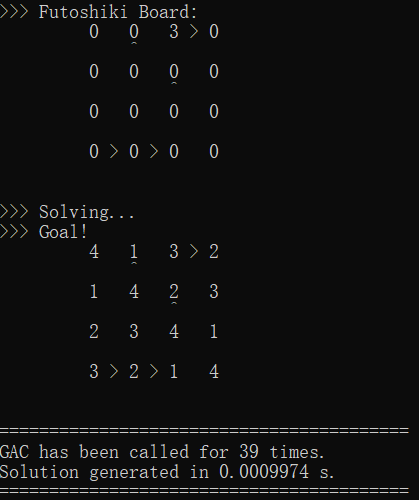
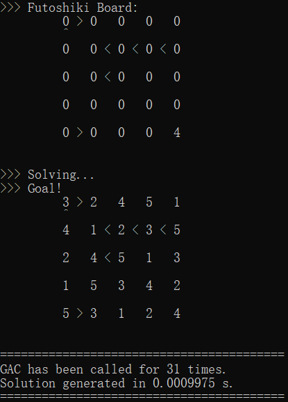
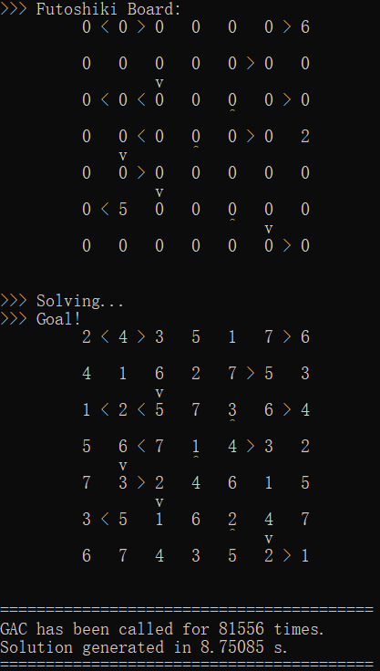
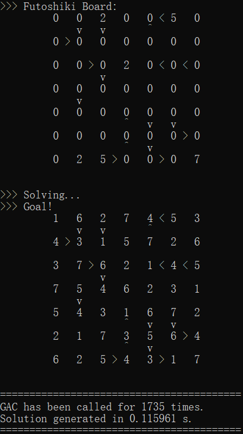
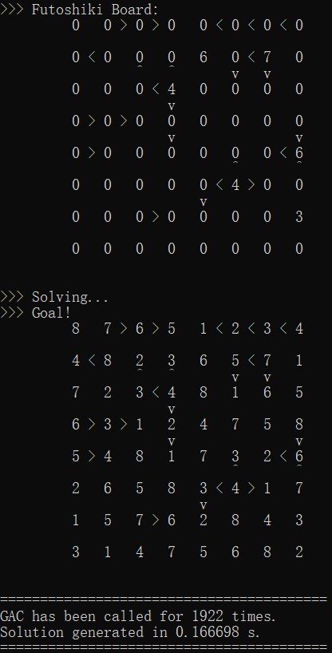
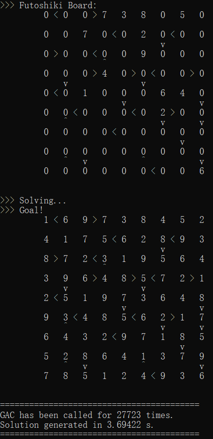

# README

A preview of this repository:

[Futoshiki](## Futoshiki)

[BlocksWorld](## BlocksWorld)

## Futoshiki

* GAC_Dynamic_Futoshiki.cpp

  Source Code.

* Futoshiki_TestSet.txt

  Test cases.

* GAC_Dynamic_Futoshiki.exe

  Executable program.

Run the `.exe` and Please refer to `Futoshiki_TestSet.txt` for test cases.

1. Just `Copy` from test cases and `Paste` on the console, then press `enter` to see the solution.
2. In addition, you could input in the `CORRECT` form and get your solution.

---

Test Results

 

 

 



---

## BlocksWorld

* blocksworld.pl

  Source Code.

* BlocksWorld-Testcases.txt

  Test cases and Results.

Run **Swipl** in the same directory by:

`swipl ./blocksworld.pl`

PLEASE BE AWARE TO INPUT:

`set_prolog_flag(answer_write_options, [max_depth(0)]).`

This sentence will allow swipl to spread the Plan instead of getting much [...].

---

```prolog
Test case 1

IN[1]:
    start1(Start), end1(Goals), objectset1(Objects), planner(Start, Goals, Objects, Plan).

OUT[1]:
    Plan = [move(b2,b1,p2),move(b1,b3,b2),move(b3,p1,p3),move(b1,b2,p1),move(b3,p3,b1)]

Extraction:
    Plan = [move(b2, b1, p2) -> 
            move(b1, b3, b2) -> 
            move(b3, p1, p3) -> 
            move(b1, b2, p1) -> 
            move(b3, p3, b1) -> stop]

==========================================================================
Test case 2

IN[2]:
    start2(Start), end2(Goals), objectset2(Objects), planner(Start, Goals, Objects, Plan).
OUT[2]:
    Plan = [move(b1,b5,p3),move(b5,b2,p4),move(b3,b4,p5),move(b4,p2,b5),move(b3,p5,p2),move(b1,p3,b3),move(b2,p1,b1)]
Extraction:
    Plan = [move(b1, b5, p3) -> 
            move(b5, b2, p4) ->
            move(b3, b4, p5) ->
            move(b4, p2, b5) ->
            move(b3, p5, p2) ->
            move(b1, p3, b3) ->
            move(b2, p1, b1) -> stop] ;
==========================================================================
Test case 3

IN[3]:
    start3(Start), end3(Goals), objectset3(Objects), planner(Start, Goals, Objects, Plan).
OUT[3]:
    Plan = [move(b3,b4,p3),move(b1,b5,b3),move(b5,b2,p4),move(b4,p2,p5),move(b2,p1,p2),move(b1,b3,b2),move(b5,p4,b1),move(b3,p3,b5),move(b4,p5,b3)]
Extraction:
    Plan = [move(b3, b4, p3) -> 
            move(b1, b5, b3) ->
            move(b5, b2, p4) ->
            move(b4, p2, b5) ->
            move(b2, p1, p2) ->
            move(b1, b3, b2) ->
            move(b5, p4, b1) -> 
            move(b3, p3, b5) -> 
            move(b4, p5, b3) -> stop] ;

==========================================================================
Test case 4

IN[4]:
    start4(Start), end4(Goals), objectset4(Objects), planner(Start, Goals, Objects, Plan).
OUT[4]:
    Plan = [move(b6,b2,p4),move(b2,b3,p6),move(b4,b5,b2),move(b1,p1,p2),move(b5,p5,p1),move(b3,p3,b5),move(b1,p2,b3),move(b4,b2,b1),move(b2,p6,b4),move(b6,p4,b2)]
Extraction:
    Plan = [move(b6, b2, p4) -> 
            move(b2, b3, p6) ->
            move(b4, b5, b2) ->
            move(b1, p1, p2) ->
            move(b5, p5, p1) ->
            move(b3, p3, b5) ->
            move(b1, p2, b3) -> 
            move(b4, b2, b1) -> 
            move(b2, p6, b4) ->
            move(b6, p4, b2) -> stop] ;
==========================================================================
Test case 5

IN[5]:
    start5(Start), end5(Goals), objectset5(Objects), planner(Start, Goals, Objects, Plan).
OUT[5]:
    Plan = [move(b4,b5,p7),move(b1,p1,p8),move(b5,p5,p1),move(b8,b7,b5),move(b6,b2,b8),move(b2,b3,b7),move(b3,p3,b6),move(b1,p8,b3),move(b4,p7,b1),move(b2,b7,b4),move(b7,p6,b2)]
Extraction:
    Plan = [move(b4, b5, p7) -> 
            move(b1, p1, p8) ->
            move(b5, p5, p1) ->
            move(b8, b7, b5) ->
            move(b6, b2, b8) ->
            move(b2, b3, b7) ->
            move(b3, p3, b6) -> 
            move(b1, p8, b3) -> 
            move(b4, p7, b1) ->
            move(b2, b7, b4) -> 
            move(b7, p6, b2) -> stop] ;
==========================================================================
```

---

2019/10 Karl [Go To Title](# README)