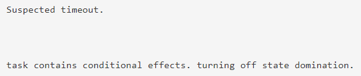
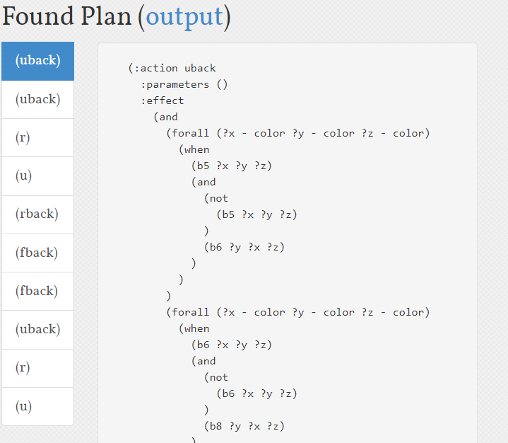
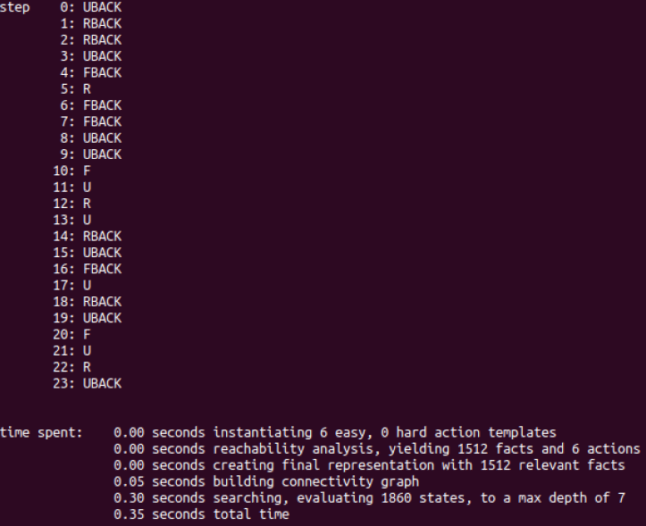
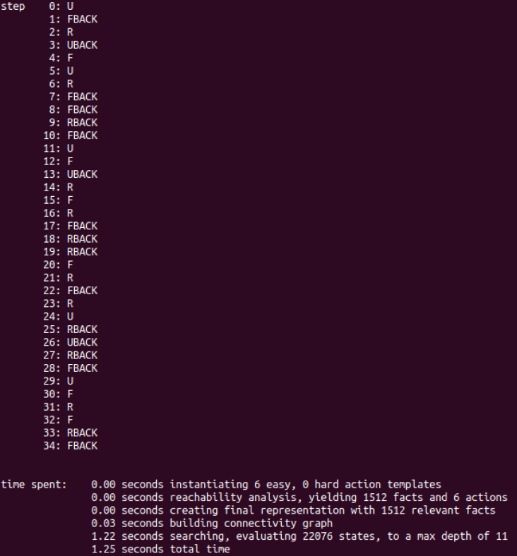
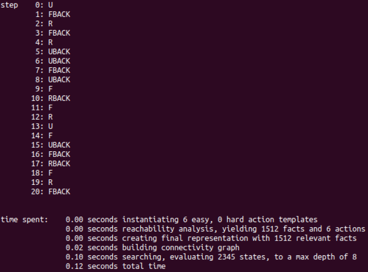

# README

Since Errors occurred millions of times on pddl on-line editor, I turn to local ff-planer for help.

---

Please do as follow for you check:

1. `cd [Prob*]`
2. `ff -o domain_cube.pddl -f cube_prob*.pddl`

Then u will see:

**Prob 1**

**Prob 2**

**Prob 3**

**Prob 4**

---

Thanks XD. 2019/10