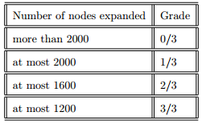

# README

[TOC]

## search - single unit

### Test 1

```shell
python pacman.py -l bigMaze -z .5 -p SearchAgent -a fn=astar,heuristic=manhattanHeuristic
```

**Implementation**

```python

def aStarSearch(problem, heuristic=nullHeuristic):
    # Use Priority Queue to implement non-recursive A*:
    # 1. Push the start node into the queue.
    # 2. Do while-loop until the queue is empty:
    #   - Get the top node.
    #   - IF the node is the GOAL
    #       * break the while-loop and return
    #   - ELSE IF the top node has been visited or has no successor:
    #       * continue
    #   - ELSE
    #       * Go through its successors.
    #       * Push those unvisited successors into the queue with their cost.
    # Return:
    #   actions: a list of actions that approach the GOAL.
    #
    from util import PriorityQueue
    actions = [] # Store the result
    tmp_actions = [] # Store the temp result in the while-loop
    visited = [] # Store the nodes that have been visited
    pQueue = PriorityQueue()
    # The priority queue
    # element type : [current state, actions so far]
    pQueue.push([problem.getStartState(), actions], 0) # Initialization

    # While-Loop
    while not pQueue.isEmpty():
        # Get the top node
        cur_node, actions = pQueue.pop()

        # GOAL, which means the cur_node is the target state, 
        # and is also the last element of the actions list.
        if problem.isGoalState(cur_node): 
            break
            
        # Check visited
        if cur_node in visited:
            continue
        
        visited.append(cur_node)
        succs = problem.getSuccessors(cur_node)
        # As declare above, getSuccessors() return a generator contains
        # elements in the form: (succ[list], Direction[n, s, e, w], cost[int])
        for succ, dir, cost in succs:
            # Also, Check visited
            if succ in visited:
                continue
            tmp_actions = actions + [dir]
            next_cost = problem.getCostOfActions(actions) 
            			+ heuristic(succ, problem)
            pQueue.push([succ, tmp_actions], next_cost)

    # Return the Goal actions
    return actions
```

**Test Result**


### Test 2

```shell
python pacman.py -l mediumCorners -p AStarCornersAgent -z 0.5
```

**Grading**



**Heuristic Func.**

```python
def cornersHeuristic(state, problem):
    # Develop this Heuristic using manhattan distance.
    corners = problem.corners # These are the corner coordinates
    walls = problem.walls # These are the walls of the maze,
    					  # as a Grid (game.py)

    x, y = state[0]
    step = (x, y)
    cur_corners = state[1]
    corners_to_approch = []
    h_n = 0

    # This Part seems to be a little tricky, I'd like to briefly
    # explain as follow:
    # 1. Go through the list 'corner'(which stores the state of
    #    each corner, 0 to be not-visited), to find those not-visited
    #    corners and add them to the list 'corners_to_approach'.
    # 2. The sentence 'while len(corners_to_approch) > 0:' means
    #    to loop until each corner is visted, during this process,
    #    the codes below will calculate what the h(n) is, 
    #    in terms of heuristic function.
    # 3. Every time in the while-loop, find the mahattan distance from 
    #    current position to each not-visited corner, choose the smallest
    #    one(this step actually means that the pacman go to the closest 
    #    corner first). Then, add the distance to h_n, remove this corner 
    #    from 'corners_to_approach'. Keep doing so until 'corners_to_approach'
    #    is empty(all corners have been visited, you win).  
    for pos in range(len(corners)):
        if not cur_corners[pos]:
            corners_to_approch.append(corners[pos])
    while len(corners_to_approch) > 0:
        tmp_dist = []
        for corner in corners_to_approch:
            dist = util.manhattanDistance(step, corner)
            tmp_dist.append(dist)
        minidist = min(tmp_dist)
        h_n += minidist
        step = corners_to_approch[tmp_dist.index(minidist)]
        corners_to_approch.remove(step)
    
    return h_n # Default to trivial solution
```

**Test Result**


### Test 3

```shell
python pacman.py -l trickySearch -p AStarFoodSearchAgent
```

**Grading**


**Heuristic Func.**

```python
def foodHeuristic(state, problem): 
    position, foodGrid = state
    food_list = foodGrid.asList()
    h_n = 0
    if not food_list:
        return 0
    
    maxdist = [(0, 0), (0, 0), 0]
    for i in food_list:
        for j in food_list:
            if i == j:
                continue
            dist = mazeDistance(i, j, problem.startingGameState)
            if maxdist[2] < dist:
                maxdist = [i, j, dist]
    if maxdist[0] == maxdist[1] == (0, 0):
        h_n = util.manhattanDistance(position, food_list[0])
    else:
        dist1 = util.manhattanDistance(position, maxdist[0])
        dist2 = util.manhattanDistance(position, maxdist[1])
        h_n = min(dist1, dist2) + maxdist[2]
    return h_n
```

**Test Result**


## Multi-Agent - multiple agent

### Preview

```shell
python pacman.py

python pacman.py -p ReflexAgent

python pacman.py -p ReflexAgent -l testClassic

python autograder.py -q q1 --no-graphics
```

**Evaluation Func.**

```python
def evaluationFunction(self, currentGameState, action):
    
    # Useful information you can extract from a GameState (pacman.py)
    successorGameState = currentGameState.generatePacmanSuccessor(action)
    newPos = successorGameState.getPacmanPosition()
    newFood = successorGameState.getFood()
    curFood = currentGameState.getFood()
    newGhostStates = successorGameState.getGhostStates()
    newScaredTimes = [ghostState.scaredTimer for ghostState in newGhostStates]
    if action == 'Stop':
        return -1
    score = 0
    # score will be made up with:
    # 1. System score >> score += successorGameState.getScore()
    # 2. Super Food at new pos >> score += scared time of all ghosts
    # 3. Closest Food and closest ghost >>
    #    dist(Food) > dist(Ghost) >> score += dist(Ghost)/dist(Food)^2 * 0.7
    #    dist(Food) <= dist(Ghost) >> score += dist(Ghost)/dist(Food)^2 * 1.1
    # 4. Food at new pos >> score * 1.2

    # 1
    score += successorGameState.getScore()

    # 2
    for scaredTime in newScaredTimes:
        score += scaredTime

    # 3
    foodList = newFood.asList()
    ghostDist = []
    foodDist = []
    for ghost in newGhostStates:
        ghostDist.append(manhattanDistance(ghost.getPosition(), newPos))
    for pos in foodList:
        foodDist.append(manhattanDistance(pos, newPos))
    if len(foodDist):
        if min(foodDist) > min(ghostDist):
            score += (min(ghostDist) * (1.0/min(foodDist))**2) * 0.8
        else:
            score += (min(ghostDist) * (1.0/min(foodDist))**2) * 1.1

	# 4
    curFoodList = curFood.asList()
    if newPos in curFoodList:
        score = score * 1.1

	return score
```

**Test Result**


### Test 1 - minimax

The minimax values of the initial state in the minimaxClassic layout are 9, 8, 7, -492 for depths
1, 2, 3 and 4 respectively. Note that your minimax agent will often win (665/1000 games for
us) despite the dire prediction of depth 4 minimax.

```shell
python pacman.py -p MinimaxAgent -l minimaxClassic -a depth=4
```

**Test Result**


### Test 2 - minimax

When Pacman believes that his death is unavoidable, he will try to end the game as soon as possible because of the constant penalty for living. Sometimes, this is the wrong thing to do with random ghosts, but minimax agents always assume the worst:

```shell
python pacman.py -p MinimaxAgent -l trappedClassic -a depth=3
```

**Test Result**


### Test 3 - minimax

```shell
python autograder.py -q q2
# python autograder.py -q q2 --no-graphics
```

**Test Result**

 

### Test 4 - alpha-beta pruning

Make a new agent that uses α−βpruning to more efficiently explore the minimax tree, in Alpha-Beta Agent. Again, your algorithm will be slightly more general than the pseudo-code from lecture, so part of the challenge is to extend the α−βpruning logic appropriately to multiple minimizer agents.

```shell
python pacman.py -p AlphaBetaAgent -a depth=3 -l smallClassic
```

**Test Result**


### Test 5 - alpha-beta pruning with deeper depth

```shell
python pacman.py -p AlphaBetaAgent -k 2 -a depth=4
```

**Test Result**


## Further Study

**scoreEvaluationFunction**

```python
def scoreEvaluationFunction(currentGameState):

	curPos = currentGameState.getPacmanPosition()
	curFood = currentGameState.getFood()
	curGhostStates = currentGameState.getGhostStates()
	curScaredTimes = [ghostState.scaredTimer for ghostState in curGhostStates]

	score = 0
	# score will be made up with:
	# 1. System score >> score += currentGameState.getScore()
	# 2. Super Food >> score += scared time of all ghosts
	# 3. Closest Food and closest (not scared) ghost >>
	#	dist(Food) > dist(Ghost) >> score += dist(Ghost)/dist(Food)^2 * 0.8
	#	dist(Food) <= dist(Ghost) >> score += dist(Ghost)/dist(Food)^2 * 1.1
	# 4. Closest Food and closest (not scared) ghost >>
	# 	score += (max(ghostDist) * (1.0/min(ghostDist)) 
    #			  * (1.0/min(foodDist))) * 1.5

	# 1
	score += currentGameState.getScore()
	
	# 2
	scared_flag = True
	for scaredTime in curScaredTimes:
		if not scaredTime:
			scared_flag = False
			break
		else:
			score += scaredTime
	
	# 3
	foodList = curFood.asList()
	ghostDist = []
	foodDist = []
	for ghost in curGhostStates:
		ghostDist.append(manhattanDistance(ghost.getPosition(), curPos))
	for pos in foodList:
		foodDist.append(manhattanDistance(pos, curPos))
	if not scared_flag and len(foodDist):
		if min(foodDist) > min(ghostDist):
			score += (min(ghostDist) * (1.0/min(foodDist))**2) * 0.8
		else:
			score += (min(ghostDist) * (1.0/min(foodDist))**2) * 1.1
	elif scared_flag and len(foodDist):
		score += (max(ghostDist) * (1.0/min(ghostDist)) 
                  * (1.0/min(foodDist))) * 1.5

	return score
```

In the evaluation, I especially focus on the ‘capsules’ which can make ghosts scared, in other words, my Pacman was designed to be more attracted by ‘scared ghost’. That’s because when testing my function with `python pacman.py -p AlphaBetaAgent -a depth=3 -l smallClassic`, I found that there’s a big bonus when the Pacman ate the scared ghost.

However, when the ghosts are far away from the Pacman, the capsules might be a waste(Sure it means my function would not work well...) because it prefers taking close food rather than traveling far to chase the scared ghosts, and the scared time might run out as well.

As further study, the parameters in the function may play important roles, but I didn't pay much attention to this research.

---

2019/10 Karl [TOP](#README)

