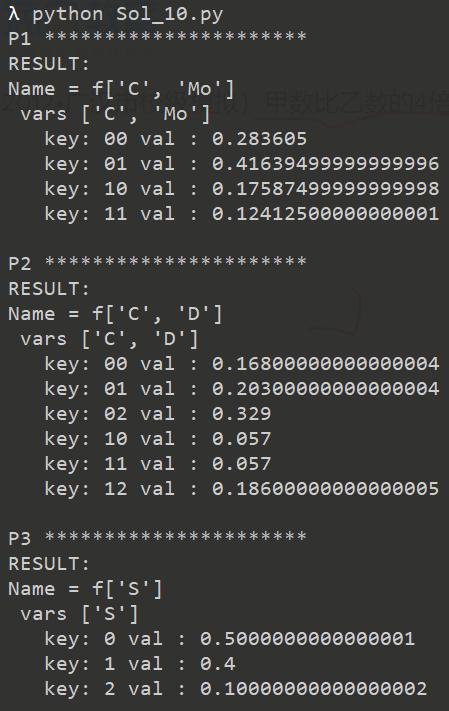
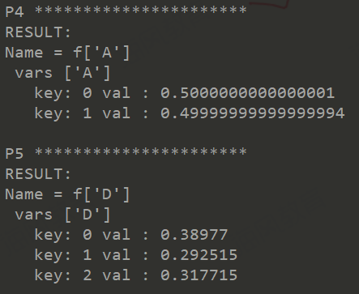

# README

In this case, I implement the VE algorithm using python, and the VE module provide an api of

```python
VariableElimination.inference(factorList, queryVariables, 
                              orderdListOfHiddenVariables, 
                              evidenceList)
```

---

### Test Cases

#### P1

p1 = P(Mortality=’True’ ∧CTScanResult=’Ischemic Stroke’ |PatientAge=’31-65’ )

```python
VariableElimination.inference(
  [P, M, C, A, S, D, Mo], ['Mo', 'C'],
  ['M', 'A', 'S', 'D'],
  {'P': 1}
)
```

####  P2

p2 = P(Disability=’Moderate’ ∧CTScanResult=’Hemmorraghic Stroke’ | 

​			PatientAge=’65+’ ∧ MRIScanResult=’Hemmorraghic Stroke’)

```python
VariableElimination.inference(
    [P, M, C, A, S, D, Mo], ['D', 'C'],
    ['A', 'S', 'Mo'],
    {'P': 2, 'M': 1}
)
```

#### P3

p3 = P(StrokeType=’Hemmorraghic Stroke’ | 

​			PatientAge=’65+’ ∧ CTScanResult=’Hemmorraghic Stroke’ ∧ 

​			MRIScanResult=’Ischemic Stroke’)

```python
VariableElimination.inference(
    [P, M, C, A, S, D, Mo], ['S'],
    ['D', 'A', 'Mo'],
    {'P': 2, 'C': 1, 'M': 0}
)
```

#### P4

p4 = P(Anticoagulants=’Used’ |PatientAge=’31-65’)

```python
VariableElimination.inference(
    [P, M, C, A, S, D, Mo], ['A'],
    ['M', 'C', 'S', 'D', 'Mo'],
    {'P': 1}
)
```

#### P5

p5 = P(Disability=’Negligible’)

```python
VariableElimination.inference(
    [P, M, C, A, S, D, Mo], ['D'],
    ['P', 'M', 'C', 'A', 'S', 'Mo'],
    {}
)
```

---

### Results





---

2019/11 Karl